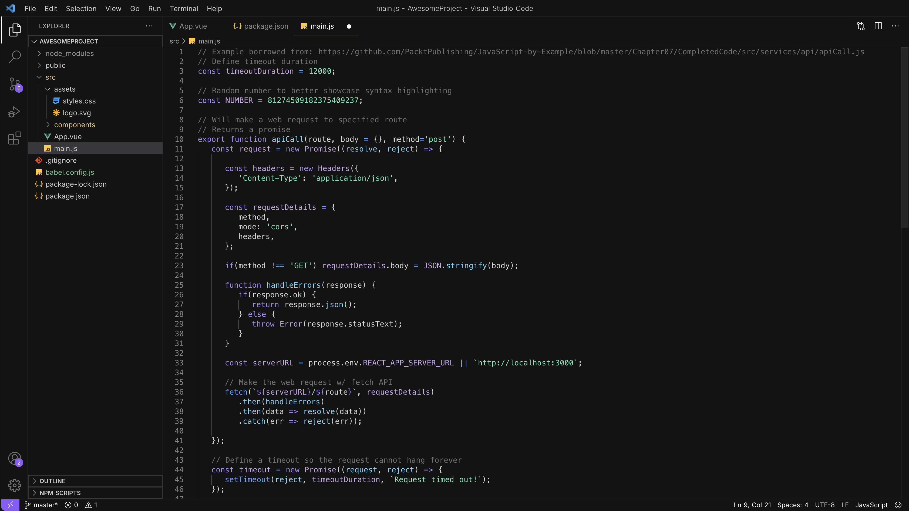

# 🍕✨ Pizzacream Dark — A Truly Dark Theme for VS Code

**Pizzacream Dark** is a pure, truly dark theme for Visual Studio Code — inspired by [True Dark](https://plugins.jetbrains.com/plugin/19348-true-dark) for JetBrains IDEs. We designed it for developers who want a real black background, high contrast, and zero compromise on readability.

## 🌙 Why Pizzacream Dark?

Many “dark” themes are actually dark gray — not this one. **Pizzacream Dark** removes unnecessary shades and tints, delivering a deep black canvas that looks stunning on OLED screens and feels easy on the eyes during late-night coding sessions.

### Features

- 🖤 **True black background**
- 🎨 Carefully balanced, vibrant syntax colors
- 👓 Clear contrast for long coding hours
- 🔥 Inspired by _True Dark_, remixed for VS Code with Pizzacream’s style

## 🚀 Installation

1. Open **Extensions** in VS Code
2. Search for **Pizzacream Dark**
3. Click **Install**
4. Activate the theme: `Cmd/Ctrl + K` `Cmd/Ctrl + T` → Select **Pizzacream Dark**

## ✨ Screenshots

 

---

 

**Crafted by [Pizzacream Studio](https://github.com/pizzacream) — inspired by the amazing [True Dark](https://plugins.jetbrains.com/plugin/19348-true-dark).**
